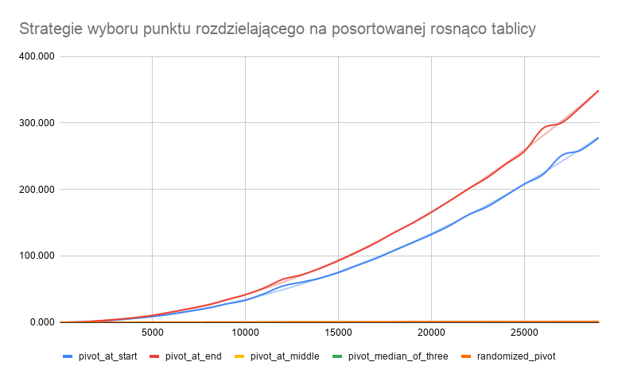
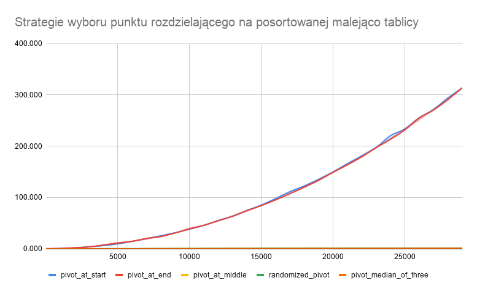
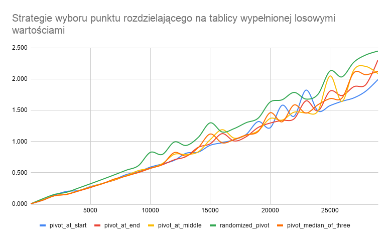

# Quicksort tests - Jakub Gonet, 24.03.2020

## Strategie wyboru elementu rozdzielającego

W wykresach zostały uwzględnione sortowania dla dzielenia tablic na dwie części dla następujących strategii:

- element rozdzielający jest **pierwszym** elementem w sortowanym fragmencie
- element rozdzielający jest **ostatnim** elementem w sortowanym fragmencie
- element rozdzielający jest **środkowym** elementem w sortowanym fragmencie- 
- element rozdzielający jest **losowo wybranym** elementem w sortowanym fragmencie
- element rozdzielający jest  elementem **mediany z trzech**  w sortowanym fragmencie

## Dane

Zostały przetestowane zestawy danych, w których liczby były;

- posortowane rosnąco oraz posortowanych  rosnąco z 10 elementami i $1$% oraz $1$‰ elementów ze zamienioną pozycją
- posortowane malejąco oraz posortowanych  rosnąco z 10 elementami i $1$% oraz $1$‰ elementów ze zamienioną pozycją
- złożone z tych samym elementów (element mały (wartość $16$) oraz element duży (wartość $2^{15}-1$))
- wypełnione losowo ($10$, $100$, $1000$, $1\,000\,000$ różnych wartości; rozkład **nierównomierny** - użyto operatora `%`)

Każdy test został uruchomiony dla tablicy wejściowej o rozmiarze $3$, $10$, $100$, $1000$, $100\,000$ elementów oraz powtórzony 10 razy, czasy wykonania zostały uśrednione.

Dodatkowo, wykonane zostały testy dla tablic wypełnionych losowo i posortowanych przy N=$1..30\,000$ z krokiem $1\,000$ (każdy powtórzony 5 razy).

## Środowisko testowe

Testy (`benchmarks.c`)  zostały przeprowadzone na MacBooku Pro 2015 z procesorem Intel(R) Core(TM) i5-5257U CPU @ 2.70GHz

  ```bash
$ uname -a
Darwin Kernel Version 18.7.0: Tue Aug 20 16:57:14 PDT 2019; root:xnu-4903.271.2~2/RELEASE_X86_64 x86_64
  ```

## Wykresy

Kompletne dane i wykresy znajdują się w [Google Spreadsheets](https://docs.google.com/spreadsheets/d/12bVOMyqUjXOqcr2JBsDKA5s4IWQmd_mYLaYl1PO1fTE/edit?usp=sharing)

W wykresach została użyta skala liniowa.








## Wnioski

### Zasada działania mediany z trzech

Strategia opiera się na wyborze trzech elementów, wyznaczenia ich mediany i użycie jej jako piwota oraz posortowania ich odpowiednio, co ma umożliwić lepszy wybór punktu rozdzielającego w kolejnych wywołaniach. 

### Na podstawie wykresów oraz zebranych danych można stwierdzić, że

- Wybór punktu rozdzielającego na początku lub końcu fragmentu powoduje zmianę asymptotycznego tempa czasu sortowania z $O(nlog(n))$ na $O(n^2)$
- Punkt rozdzielający wybierany na końcu sortowanego przedziału jest nieznacznie lepszy od wybierania go na początku (w sytuacji, gdy tablica jest posortowana wybór początkowego elementu przedziału jest lepszy)
- Punkt wybierany losowo wraz ze wzrostem danych zbliża się do sytuacji optymalnej $ O(nlogn) $, lecz jest gorszy w typowych przypadkach.
- Jedną z bardziej optymalnych strategii jest wybór elementu na środku przedziału, czasy wykonania porównywalne ze strategią MO3
- Strategia mediany z trzech (MO3) działa optymalnie poza anomalią w tablicy posortowanej malejąco

